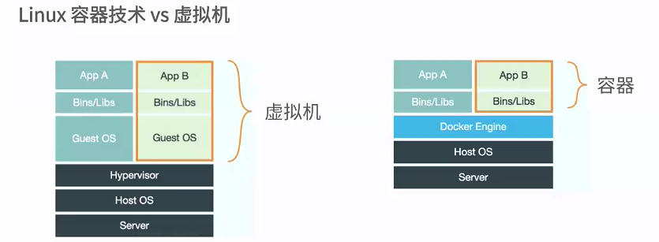

# docker-1

## 什么是容器
 容器时一种虚拟化的方案
 操作系统级别的虚拟化
 只能运行相同或者相似的内核的操作系统
 以来于Linux内核特性：Namespace和Cgroup(Control Group)

## docker容器技术和虚拟机的比较

## 什么时docker

将应用程序自动部署到容器、
Go语言开源引擎
2013年初 有dotCloud发布
基于Apache2.0开源授权协议发布

## docker的目标

提供简单轻量的建模方式(可以快速的启动)
职责的逻辑分离(开发运维人员的职责分开)
快速高效的开发生命周期(从开到生产都是以相同的环境，避免了环境的不同而带来的问题)
鼓励适用面向服务的架构

## Docker的适用场景

1. 适用Docker容器开发，测试，部署服务
2.创建隔离的运行环境
3.搭建测试环境
4.构建多用户的平台即服务(Paas)基础设施
5.高性能，超大给i莫的宿主机部署

