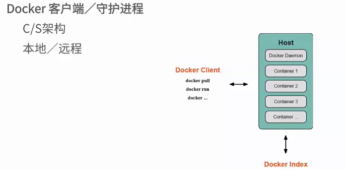
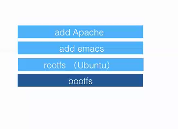
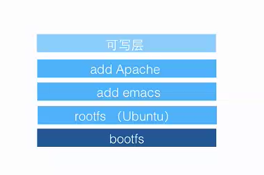
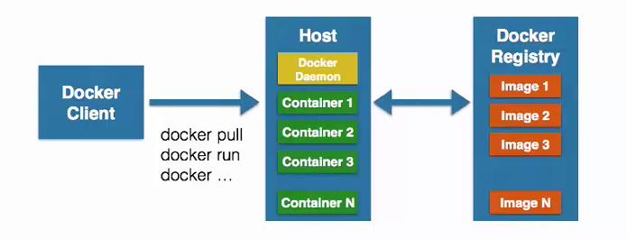

# docker的基本组成

* Docker Client客户端

* Docker Daemon守护进程

* Docker Image镜像

* Docker Registry创库

## Docker Client客户端

Docker客户端/守护进程

C/S架构
本地/远程

结构如图所示：

## Docker Image镜像

容器的基石

层叠的只读文件系统

联合加载(union mount)

结构如图所示：

bootfs:引导启动系统，系统启动时加载到内存，启动后会从内存中卸载
rootfs:rootfs,只读文件系统
联合加载技术时一次加载多个文件系统。

## Docker Contaiiner容器

通过镜像启动

启动和执行阶段

写时复制(copy on write,这是docker的一个重要的特征)

##  Docker Registry仓库

公有
私有
Docker Hub

## Docker的基本组成

## 基本操作
//查找镜像
docker search "查找的镜像的名字"

//拉取镜像
docker pull "完整的镜像名字"

//启动容器
docker run "镜像名字" +执行的命令

//查看运行的镜像
docker ps -l

//提交新的镜像

docker commit  "镜像id" "新的镜像的名字"

//查看运行的容器的信息(返回json)
docker inspect "容器id"

docker tag "新构建的镜像名" "自己dockerhub的名称/ping"

