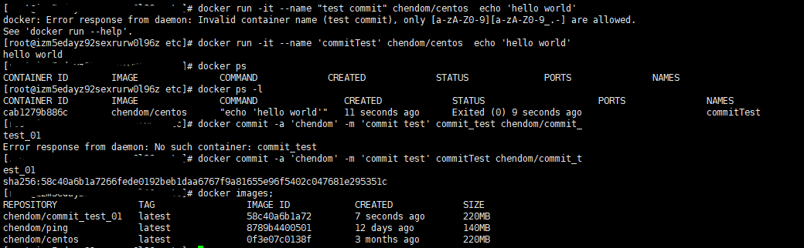

# 构建镜像

## 保存对容器的修改，并再次使用

* docker commit 通过容器构建

docker commit [OPTIONS] CONTAINER [REPOSITORY[:TAG]]
-a,--author="" Author(作者，例如：John Hannibal Smith hannibal@a-team.com)
-m,--message="" (提交信息)
-p,--pause=true (构建的时候停止容器)

要先启动容器，然后使用容器去构建镜像

* docker build 通过Dockerfile文件构建

1. 创建Dockerfile
2. 使用docker build命令

## 自定义镜像的能力

## 以软件的形式打包并分发服务极其运行环境

