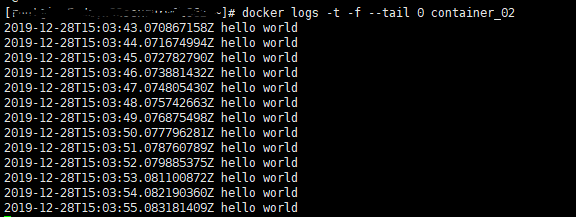
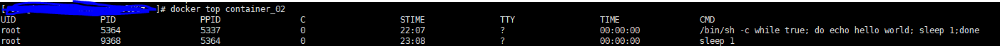
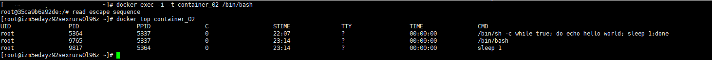

#Docker守护式容器

1. 能够长期运行
2. 没有交互式会话

## 以守护式形式运行容器

* docker run -it IMAGE /bin/bash
* 需要配合Ctrl+P 和Ctrl+Q
* 进入和守护式的形式之后，可以使用docker attach + dockerId再次进入交互式

## 启动守护式容器：

docker run -d 镜像名 [COMMAND][ARG...]

例如：docker run --name=container_02 -d chendom/ping /bin/sh  -c "while true; do echo hello world; sleep 1;done"
就会一直大一hello world

## 查看容器日志
docker logs [-f][-t][--tail] 容器名
-f --follows=true|flase 默认为false(一直跟踪日志的变化，并且返回结构)
-t --timestamps=true|false 默认为false(日志加上时间戳)
--tail="all"(返回日志末尾处的多少日志，如果不指定会返回所有的日志)

## 查案容器内的进程

docker top 容器名

## 在运行的容器内启动新的进程

docker exec [-d][-i][-t] 容器名称[COMMAND][ARG..]

## 停止守护容器

docker stop 容器名(等待结束)
docker kill 容器名(直接结束)

