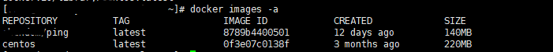

# 获取和推送镜像

## 查找镜像

* Docker Hub
    https://registry.hub.docker.com
* docker search [OPTION] TERM
    --automated=false Only show automated build(仅显示自动生成)
    --no-trunc=false Don't truncate output(没有截断的)
    -s,--stars=0 Only displays with at least x stars.(指定星数的)   

## 拉取镜像

docker pull [OPTIONS] NAME [:TAG]
-a,--all-tags=false Download all tagged images in the repository(下载存储库中的所有标记图像)

查看机器的镜像可以发现多了一个镜像

## 推送镜像
docker push name[:TAG]

切记，一定要在名称前加上自己的docker hub的Docker ID

