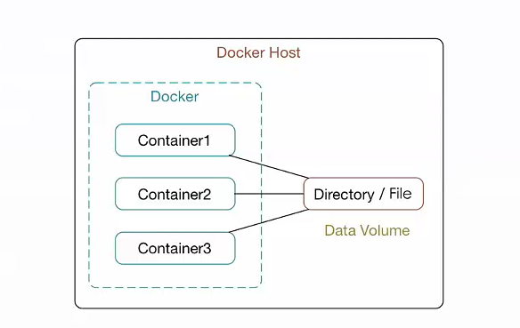
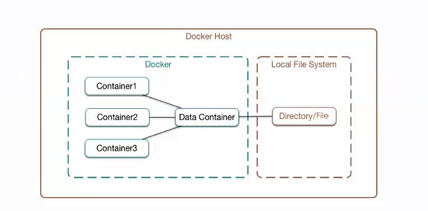

# Docker容器的数据管理

## Docker容器的数据卷(DATA Volume)

1.什么是数据卷？
数据卷是经过特殊设计的目录，可以绕过联合文件系统的(UFS),为一个或者多个容器提供访问
2. 数据卷设计的目的
数据卷设计的目的，在于将数据的永久化，他完全的独立于容器的生命周期，因此Docker不会在容器删除的时候删除其挂载的数据卷，也不会在类似的
垃圾收集机制，对容器引用的数据卷进行处理。

数据卷(Data Volume)的特点

* 数据卷在容器启动的时初始化，如果容器使用的镜像挂载点包含了数据，这些数据会拷贝道心初始化的数据卷中。

* 数据卷可以在容器之间共享和重用

* 可以对数据间里的内容直接进行修改

* 数据卷的变化不会影响镜像的更新

* 卷会一直存在，几时挂载数据卷的容器已经被删除

为容器添加数据卷
~~~
docker run -v ~/container_data:/data -it centos /bin/bash

~~~

使用Dockerfile构建包含数据卷的镜像
指令：
VOLUME["/data","/data"]

# Docker的数据卷容器

数据卷容器：命名的容器挂载数据卷，其他容器通过挂载这个容器实现数据共享，挂载数据卷的容器，就叫做数据卷。

数据卷容器

## 挂载数据卷容器的方法
docker run --volumes-from [CONTAINER NAME]

# Docker数据卷的备份和还原--数据备份

docker run --volume-from [container name] -v ${pwd}:/back centos tar cvf /back/backup.tar [container data volume]

## Docker的数据卷容器

## Docker数据卷的备份和还原

