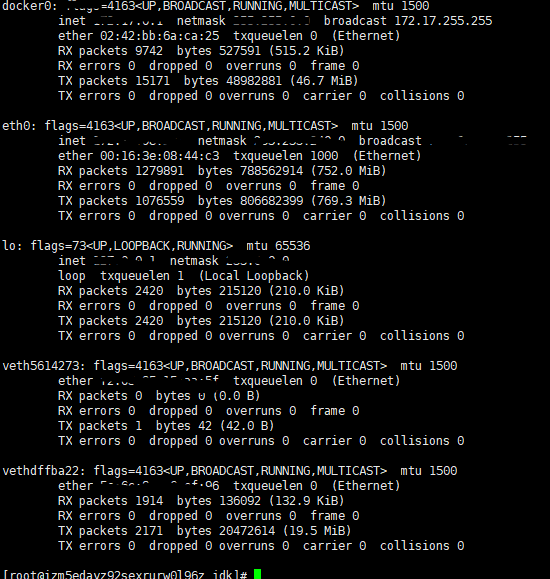

# Docker网络基础

## docker0
docker0实际上linux的虚拟网桥(数据链路层的一种设备)

* Linux虚拟网桥的特点

1. 可以设备IP地址
2. 相当于用于一个隐藏的虚拟网卡

[linux虚拟网桥](images/docker-22.png)

安装了bridge-utils工具之后实现查看dicker0网桥的情况如下:

[linux虚拟网桥](images/docker-23.png)

## 修改docker0地址

ifconfig docker0 192.168.200.1 network 255.255.255.0

