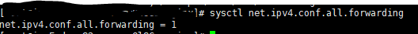
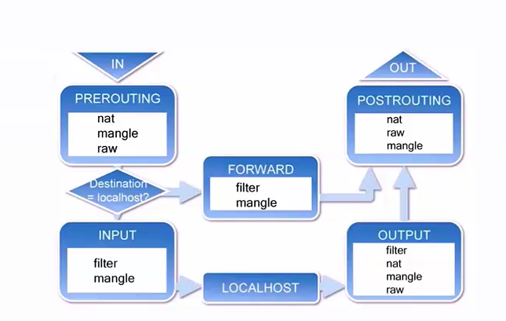

# Docker容器与外部网络的连接

* ip_forward


* iptables

* 允许端口映射访问

* 限制ip访问容器


## ip_forward
使用如下的方式查看：

```$xslt
--ip_forward=true
```

## iptables

iptables是与linux内核继承的包过滤防火墙系统，几乎所有的linux发行版本都会包含iptables的功能.



* 表(table)

* 链(chain)

filter表的包含的链

1. INPUT
2. FORWARD
3. OUTPUT


* 规则(rule)

  ACCEPT
  REJECT
  DROP


