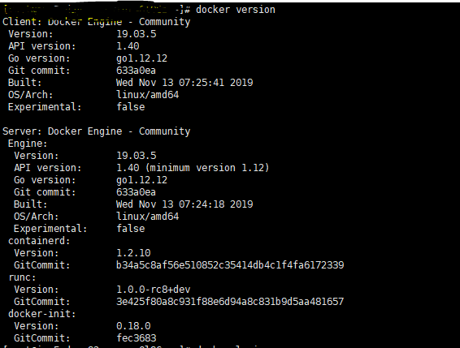

# Centos7 Dcker安装于配置

1. 把yum包更新到最新
yum update

2. 安装需要的软件包
yum install -y yum-utils device-mapper-persistent-data lvm2

3. 设置yum源
yum-config-manager --add-repo https://download.docker.com/linux/centos/docker-ce.repo

4.查看所有仓库中所有docker版本，并选择特定版本安装
yum list docker-ce --showduplicates | sort -r

5.安装Docker
 yum install docker-ce-3:19.03.5-3.el7

6. 启动Docker
systemctl start docker
systemctl enable docker

7. 验证是否安装成功
docker version

# 加速

使用Docker 中国加速器
由于网络原因，我们在pull Image 的时候，从Docker Hub上下载会很慢。

修改文件